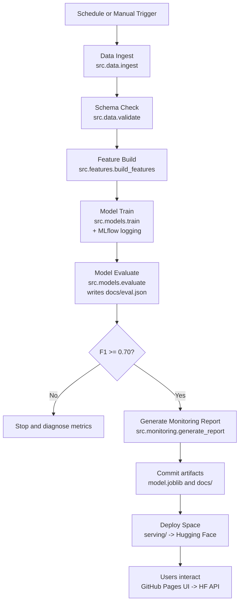

# usa-work-visa-prediction-ml-logistic-regression
[](https://github.com/Gr1cLev/usa-work-visa-prediction-MLFlow-logistic-regression/actions/workflows/ci.yml)
[](https://github.com/Gr1cLev/usa-work-visa-prediction-MLFlow-logistic-regression/actions/workflows/retrain_and_deploy.yml)
[](https://huggingface.co/spaces/gchrd/visa-lca-api)
[](https://gr1clev.github.io/usa-work-visa-prediction-MLFlow-logistic-regression/ui/)


This repository hosts a project that estimates whether a United States work visa Labor Condition Application (LCA) is likely to be **certified** or **denied**. The classifier uses logistic regression and demonstrates an end-to-end MLOps workflow covering ingestion, validation, feature engineering, MLflow-backed training, evaluation, monitoring with Evidently, automated redeployment to Hugging Face Spaces, and a FastAPI + static web UI.

> **Notes:** this project is for learning only. The predictions rely on public LCA disclosure data and a lightweight model. They are **not** a substitute for legal advice or official determinations.

## Explore Material
- Download the latest public LCA disclosure dataset from data.gov (or fall back to a synthetic sample if an API key is not provided).
- Validate input tables against a Pandera schema before training.
- Build features, train a logistic regression model, and log metrics to MLflow.
- Evaluate the trained model, export summary artifacts, and generate an Evidently data drift report.
- Serve predictions through a FastAPI endpoint and interact via the dropdown-friendly UI located in `docs/ui`.

## Live demo
- **User interface** (GitHub Pages): https://gr1clev.github.io/usa-work-visa-prediction-MLFlow-logistic-regression/ui/  
  When the page loads, set the API Address field to `https://gchrd-visa-lca-api.hf.space` before clicking **Predict**.
- **Prediction API** (Hugging Face Space): https://gchrd-visa-lca-api.hf.space/  
  Health endpoint: `/health`; predictions: POST `/predict` with JSON payload.

## Quickstart
```bash
pip install -r requirements.txt

# Run the pipeline step by step
python -m src.data.ingest
python -m src.data.validate
python -m src.features.build_features
python -m src.models.train
python -m src.models.evaluate
python -m src.monitoring.generate_report

# Launch the API
uvicorn src.serving.app:app --reload --port 8000

# Open the web UI
# Option 1: double-click docs/ui/index.html
# Option 2: host via GitHub Pages or any static site host
```

## Environment variables
Set these in a `.env` file (see `.env.example`) or your shell as needed:

| Variable | Purpose |
|----------|---------|
| `DATAGOV_API_KEY` | Required to fetch real LCA data from data.gov. Leave empty to fall back to the synthetic sample. |
| `DATA_GOV_API_URL` | (Optional) Override the CKAN endpoint. Defaults to the standard data.gov URL. |
| `LCA_YEAR` | (Optional) Prefer a specific fiscal year when searching for LCA resources. |
| `MAX_ROWS` | (Optional) Limit the number of rows ingested for quicker experiments. Defaults to 40000. |
| `MODEL_PATH` | (Optional) Path to the serialized model when serving. Defaults to `artifacts/model.joblib`. |

The serving app automatically looks for a `.env` file beside the executable or one directory above it (for example `/app/.env` or the project root). If it cannot find one, it falls back to regular environment variables.

## Serving and deployment
- **Local FastAPI**: run `uvicorn src.serving.app:app --reload --port 8000` to expose the prediction API locally.
- **Docker / Hugging Face Space**: the `serving/` folder contains a slim Dockerfile and requirements file. It copies `app.py` and `model.joblib`, installs dependencies, and sets `MODEL_PATH`. Push the folder to a Space (or build the image yourself) and place `.env` next to `app.py` if you need secrets.
- **Static UI**: once the API is reachable, open `docs/ui/index.html`. Every form element is a dropdown with an "Other" option so non-technical users can enter custom values.

## Workflow at a glance


## Repository layout
```
src/
  data/{ckan_fetch_latest.py, ingest.py, validate.py}
  features/build_features.py
  models/{train.py, evaluate.py}
  monitoring/generate_report.py
  serving/app.py
configs/{training.yaml, schema.yaml, thresholds.yaml}
docs/{index.html, report.html, eval.json, ...}
docs/ui/{index.html, styles.css, script.js}
.github/workflows/{ci.yml, pages.yml, retrain_and_deploy.yml}
artifacts/
```

## Automation summary
- **Scheduled retrain** (`retrain_and_deploy.yml`): pulls data, runs the entire pipeline, gates on positive-class F1 >= 0.70, commits refreshed artifacts, and redeploys the Space.
- **CI smoke tests** (`ci.yml`): installs dependencies and executes the `tests/` suite on each push or PR.
- **Dedicated deployment** (`deploy-hf.yml`): optional workflow to push the serving folder whenever it changes.

